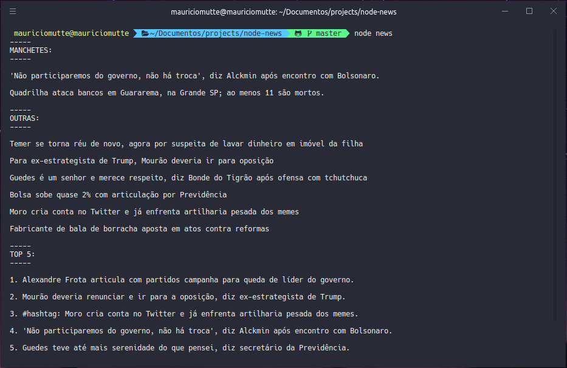

# node-news

Node-news é um web scraping feito em NodeJS que coleta os títulos das principais notícias do site Folha de S.Paulo e as exibe no seu terminal, de uma forma simples, rápida e clara. Com outro simples comando, você ainda pode abrir a página inicial da Folha de SP para ler o texto desejado.



## Baixando e instalando dependências

### Baixar o código

Para baixar o código você deve clicar no botão 'fork' e então, clonar o repositório

### Instalando dependências

Antes de mais nada você precisa instalar o [Node](https://nodejs.org/pt-br/) no seu PC. Após isso, você já pode instalar as dependências executando o seguinte comando:

```bash
  npm i request cheerio
```

## Comandos

Já no diretório do node-news, você pode executar os seguintes comando:

```bash
  node news (mostra as notícias)

ou

  node go (abre a página no seu navegador)
```

## Criando um comando personalizado

### Linux (Ubuntu)

Para criar um comando personalizado no Linux é fácil, basta digitar no terminal:

```bash
  alias nomeDoComando='dentro das aspas simples vai o seu comando'
```